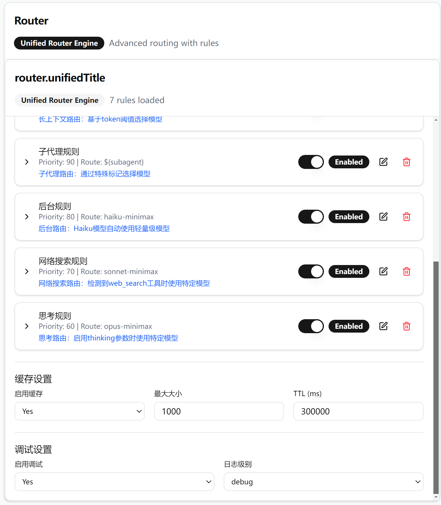

# Claude Code Router CLI v2.0.6

<div align="center">

[](https://github.com/dedenlabs/claude-code-router-cli)
[](LICENSE)
[](https://nodejs.org/)
[](https://www.typescriptlang.org/)

**基于 [@musistudio/claude-code-router](https://github.com/musistudio/claude-code-router) 的增强版命令行路由工具**

[✨ 新功能概览](#-新功能) • [🚀 快速开始](#-快速开始) • [📖 完整文档](./docs/UNIFIED_ROUTER_GUIDE.md) • [📋 路由规则](./docs/UNIFIED_ROUTER_RULES.md) • [🔧 示例配置](./examples/) • [📚 官方教程](https://code.claude.com/docs/en/quickstart)

</div>

## 🎯 核心亮点

### ⚡ 统一路由引擎 (Unified Router Engine)
全新的基于规则的路由系统，支持复杂条件和优先级管理

### 🔌 外部规则支持 (External Rules)
动态加载自定义JavaScript规则，实现个性化路由策略

### 📊 智能日志系统 (Smart Logging)
可视化的路由决策过程，支持多级别调试输出

**info 级别日志示例**
```
🚀 ──────────────────────────────────────
 📝 用户请求开始 [2025/12/07 00:35:46] 🎯 目标模型: opus
 🔗 请求ID: b8fdsc4f-ba72-4e2c-967d-2be41577f820
 ✨ 规则触发: 代号映射规则
 📍 路由决策: opus → opus/glm-4.6
 📝 请求文本: <system-reminder>...
As you answer the user's questions, you can use the following context:...
请帮我总结并commit内容
 📊 Token使用量: 51,385 (长上下文模式)
 🚀 ──────────────────────────────────────
💡 GLM思考中... 启用logical类型思维模式 
```

**debug 级别日志示例**
```
🚀 ──────────────────────────────────────
 📝 用户请求开始 [2025/12/07 00:05:58] 🎯 目标模型: haiku
 🔗 请求ID: f8fddc2d-bc3a-41e9-9ea3-3dd1338d895d
🔍 [DEBUG] 开始评估路由 {"requestedModel":"haiku","tokenCount":1232464}
🔍 [DEBUG] 🔍 开始评估路由规则 {"请求模型":"haiku","Token数量":1232464,"启用规则数":7,"总规则数":7}
🔍 [DEBUG] 评估条件 {"conditionType":"custom","condition":{"type":"custom","customFunction":"modelContainsComma"},"requestedModel":"haiku"}
🔍 [DEBUG]   规则 "用户指定规则" (优先级: 200)
🔍 [DEBUG]     条件: 自定义函数: modelContainsComma
🔍 [DEBUG]     结果: ❌ 不匹配
🔍 [DEBUG] 评估条件 {"conditionType":"custom","condition":{"type":"custom","customFunction":"directModelMapping"},"requestedModel":"haiku"}
🔍 [DEBUG]   规则 "代号映射规则" (优先级: 190)
🔍 [DEBUG]     条件: 自定义函数: directModelMapping
🔍 [DEBUG]     结果: ✅ 匹配
🔍 [DEBUG] 🎯 规则 "代号映射规则" 匹配成功，停止后续评估
🔍 [DEBUG] 尝试代号模型映射 {"modelName":"haiku","providersCount":3}
🔍 [DEBUG] 未找到代号模型映射，尝试通过 provider 名称匹配 {"modelName":"haiku"}
🔍 [DEBUG] 🔄 变量替换完成 {"原始路由":"${mappedModel}","最终路由":"haiku,glm-4.5-air"}
 ✨ 规则触发: 代号映射规则
 📍 路由决策: haiku → haiku/glm-4.5-air
 📝 请求文本:
 Please write a 5-10 word title for the following conversation:...
...
Respond with the title for the conversation and nothing else.
 📊 Token使用量: 1,232,464 (长上下文模式)
🔍 [DEBUG] 路由决策详情 {"finalRoute":"haiku,glm-4.5-air","provider":"haiku","model":"glm-4.5-air","decisionTime":"3ms","fromCache":"否"}
 🚀 ──────────────────────────────────────
```

### 🔄 配置自动迁移 (Auto Migration)
一键从旧版本配置迁移到新的统一路由格式

**一行代码即可完成迁移：**
```bash
ccr migrate
```

迁移工具会自动：
- ✅ 备份现有配置到 `~/.claude-code-router/config.backup.json`
- ✅ 转换为统一路由引擎格式
- ✅ 保留所有原有路由逻辑
- ✅ 生成详细迁移报告


### 🎛️ GLM思考模式 (GLM Thinking)
内置GLM模型思考转换器，提升推理质量

---

## 🚀 快速开始

### 1. 安装依赖

```bash
# 安装 Claude Code
npm install -g @anthropic-ai/claude-code

# 安装 Router CLI
npm install @dedenlabs/claude-code-router-cli
```

### 2. 配置环境

**启动路由服务：**
```bash
# 前台运行
ccr start
# 或
# 后台运行
ccr start -b
```

**修改配置文件：**

启动服务后会创建默认配置，您可以通过两种方式编辑路由规则和替换密钥：

1. **手动编辑**：修改 `~/.claude-code-router/config.json` 配置文件
2. **可视化界面**：访问 http://localhost:3456/ui/ 

推荐使用模型替换规则，只需修改路由映射，所有IDE工具无需改动：

```json
{
  "Router": {
    "rules": [
      {
        "name": "haiku模型替换规则",
        "condition": {
          "type": "modelContains",
          "value": "haiku"
        },
        "action": {
          "route": "haiku-XXX"
        },
        "priority": 205
      }
    ]
  }
}
```

**配置 Claude 环境变量：**
```bash
# 编辑 Claude 配置文件
# Windows: C:\Users\%USERNAME%\.claude\settings.json
# macOS/Linux: ~/.claude/settings.json

{
  "env": {
    "ANTHROPIC_BASE_URL": "http://localhost:3456",
    "ANTHROPIC_AUTH_TOKEN": "sk-anything",
    "API_TIMEOUT_MS": "3000000",
    "CLAUDE_CODE_DISABLE_NONESSENTIAL_TRAFFIC": "1",
    "ANTHROPIC_DEFAULT_HAIKU_MODEL": "haiku",
    "ANTHROPIC_DEFAULT_SONNET_MODEL": "sonnet",
    "ANTHROPIC_DEFAULT_OPUS_MODEL": "opus"
  },
  "model": "sonnet"
}
```

### 3. 开始使用

```bash
# 方式1: 直接使用 Claude (推荐)
claude

# 方式2: 通过路由启动
ccr code "你的提示词"

# 方式3: 通过IDE启动

#### VS Code 用户
- 安装 [Claude Code 官方扩展](https://marketplace.visualstudio.com/items?itemName=anthropic.claude-code)
- 支持版本：VS Code 1.98.0 或更高版本
- 扩展提供原生 IDE 体验，包括专用 Claude Code 侧边栏面板、计划模式、自动接受编辑等功能

#### ZED 编辑器用户
- ZED 编辑器内置了 Claude Code 作为外部代理支持（ACP - Agent Configuration Protocol）
- 无需安装额外插件，直接在设置中配置 Claude Code
- 支持为 Claude Code 设置默认模型和配置选项

# 管理服务
ccr status    # 查看状态
ccr stop      # 停止服务
```

> 💡 **提示**: 建议使用方式1，这样可以在VS Code、ZED等编辑器中直接使用路由功能

---

## ✨ 新功能概览

### 🔄 统一路由引擎

新版本将原有的多种路由模式（默认、后台、思考、长上下文）统一为基于规则的灵活系统：

```json
{
  "Router": {
    "engine": "unified",
    "defaultRoute": "sonnet-minimax",
    "rules": [
      {
        "name": "长上下文规则",
        "priority": 100,
        "condition": {
          "type": "tokenThreshold",
          "value": 180000,
          "operator": "gt"
        },
        "action": {
          "route": "sonnet",
          "description": "长上下文路由：基于token阈值选择模型"
        }
      }
    ]
  }
}
```
#### 🌐 可视化配置界面
提供直观的 Web UI 界面，方便配置路由规则和监控服务状态

**访问地址：** http://localhost:3456/ui/



**功能特性：**
- ✅ 可视化路由规则管理
- ✅ 实时服务状态监控
- ✅ 交互式配置编辑器
- ✅ 模型使用统计展示

### 🔌 外部规则支持 (示例)

通过外部JavaScript文件定义复杂路由逻辑，支持：

**1. 调试日志收集** 📊
```javascript
// examples/external-rules/debug-logger.js
function printModelRequestData(context) {
  // 变量式日志收集，每种类型单独存储
  const outputTypes = ['basic', 'messages', 'tools', 'usage'];

  // 收集基本信息
  let basicInfo = `Token数量: ${context.tokenCount}`;

  // 收集消息内容
  let messages = '';
  context.messages.forEach(msg => {
    messages += `${msg.role}: ${msg.content.substring(0, 100)}...`;
  });

  // 选择性输出到控制台和文件
  console.log(`[调试] ${basicInfo}\n${messages}`);

  return false; // 不拦截路由
}

module.exports = printModelRequestData;
```

详细使用说明请参考：[🔍 调试日志脚本使用指南](./examples/README-调试日志脚本.md)

**2. 用户偏好路由** 👤
```javascript
// 根据用户邮箱路由到偏好模型
function checkUserPreference(context) {
  const userId = extractUserId(context); //context.body.metadata.user_id
  return userPreferences[userId] !== undefined;
} 
```

**3. 时间路由** ⏰
```javascript
// 根据工作时间路由到不同模型
function isBusinessHours(context) {
  const hour = new Date().getHours();
  return hour >= 9 && hour < 18;
}
```

### 📊 智能日志输出

启用调试模式查看详细的路由决策过程：

```json
{
  "debug": {
    "enabled": true,
    "logLevel": "debug"
  }
}
```

## 📋 配置示例

### 快速配置模板

如果你想快速开始，直接运行 `ccr start` 命令之后会自动创建类似如下的配置文件，你也可以直接手动创建或编辑 `~/.claude-code-router/config.json`：
需要手动替换`YOUR_MINIMAX_API_KEY`或`YOUR_GLM_API_KEY`，或则手动新增其它平台和模型.
```json
{
  "LOG": true,
  "LOG_LEVEL": "info",
  "HOST": "127.0.0.1",
  "PORT": 3456,
  "APIKEY": "sk-anything",
  "API_TIMEOUT_MS": 600000,

  "transformers": [
    {
      "path": "./transformers/glm-thinking.js",
      "options": {
        "enabled": "false",
        "debug": "true"
      }
    }
  ],

  "Providers": [
    {
      "name": "sonnet-minimax",
      "api_base_url": "https://api.minimaxi.com/anthropic/v1/messages",
      "api_key": "YOUR_MINIMAX_API_KEY",
      "models": ["MiniMax-M2"],
      "transformer": { "use": ["Anthropic"] }
    },
    {
      "name": "opus-glm",
      "api_base_url": "https://api.z.ai/api/coding/paas/v4/chat/completions",
      "api_key": "YOUR_GLM_API_KEY",
      "models": ["glm-4.6"],
      "transformer": { "use": ["reasoning", "glm-thinking"] }
    },
    {
      "name": "haiku-glm",
      "api_base_url": "https://open.bigmodel.cn/api/anthropic/v1/messages",
      "api_key": "YOUR_GLM_API_KEY",
      "models": ["glm-4.5-air"],
      "transformer": { "use": ["Anthropic"] }
    }
  ],

  "Router": {
    "engine": "unified",
    "defaultRoute": "sonnet-minimax",
    "rules": [
      {
        "name": "haiku模型替换规则",
        "condition": {
          "type": "modelContains",
          "value": "haiku",
          "operator": "contains"
        },
        "action": {
          "route": "haiku-minimax",
          "description": "模型替换任意模型规则"
        },
        "priority": 205,
        "enabled": true
      },
        {
        "name": "sonnet模型替换规则",
        "condition": {
          "type": "modelContains",
          "value": "sonnet",
          "operator": "contains"
        },
        "action": {
          "route": "sonnet-minimax",
          "description": "模型替换任意模型规则"
        },
        "priority": 205,
        "enabled": true
      },
      {
        "name": "opus模型替换规则",
        "condition": {
          "type": "modelContains",
          "value": "opus",
          "operator": "contains"
        },
        "action": {
          "route": "opus-minimax",
          "description": "模型替换任意模型规则"
        },
        "priority": 205,
        "enabled": true
      },
     //---------以下规则不是必须的-----------
      {
        "name": "用户指定规则",
        "priority": 200,
        "enabled": true,
        "condition": {
          "type": "custom",
          "customFunction": "modelContainsComma"
        },
        "action": {
          "route": "${userModel}",
          "description": "用户直接指定 provider,model 格式"
        }
      },
      {
        "name": "代号映射规则",
        "priority": 190,
        "enabled": true,
        "condition": {
          "type": "custom",
          "customFunction": "directModelMapping"
        },
        "action": {
          "route": "${mappedModel}",
          "description": "将provider作为代号，映射到对应的model模型"
        }
      },
      {
        "name": "长上下文规则",
        "priority": 100,
        "enabled": true,
        "condition": {
          "type": "tokenThreshold",
          "value": 180000,
          "operator": "gt"
        },
        "action": {
          "route": "sonnet-minimax",
          "description": "基于token阈值选择模型"
        }
      },
      {
        "name": "后台规则",
        "priority": 80,
        "enabled": true,
        "condition": {
          "type": "modelContains",
          "value": "haiku",
          "operator": "contains"
        },
        "action": {
          "route": "haiku-glm",
          "description": "Haiku模型自动使用轻量级模型"
        }
      }
    ],
    "cache": {
      "enabled": true,
      "ttl": 300000,
      "maxSize": 1000
    },
    "debug": {
      "enabled": true,
      "logLevel": "info"
    }
  }
}
```

### 🛠️ 高级配置

#### 外部规则配置示例

参考 [`examples/config-with-external-rules.json`](./examples/config-with-external-rules.json)：

```json
{
  "Router": {
    "engine": "unified",
    "rules": [
      {
        "name": "用户偏好路由",
        "priority": 100,
        "enabled": true,
        "condition": {
          "type": "externalFunction",
          "externalFunction": {
            "path": "./external-rules/user-preference.js",
            "functionName": "checkUserPreference"
          }
        },
        "action": {
          "route": "gpt-4,openai"
        }
      },
      {
        "name": "时间路由",
        "priority": 90,
        "enabled": true,
        "condition": {
          "type": "externalFunction",
          "externalFunction": {
            "path": "./external-rules/time-based.js",
            "functionName": "isBusinessHours"
          }
        },
        "action": {
          "route": "claude-3-opus,anthropic"
        }
      }
    ]
  }
}
```

#### 固定路由配置示例

参考 [`examples/configs/fixed-router-config.json`](./examples/configs/fixed-router-config.json)：

```json
{
  "Router": {
    "engine": "unified",
    "defaultRoute": "openrouter,anthropic/claude-3.5-sonnet",
    "rules": [
      {
        "name": "代码任务路由",
        "priority": 80,
        "enabled": true,
        "condition": {
          "type": "fieldExists",
          "field": "messages.0.content",
          "value": "代码",
          "operator": "contains"
        },
        "action": {
          "route": "openrouter,anthropic/claude-3.5-sonnet"
        }
      }
    ]
  }
}
```

## 🔄 配置迁移

### 自动迁移 (推荐)

如果你有旧版本的配置，可以使用自动迁移工具：

```bash
# 自动迁移旧配置到统一路由引擎
ccr migrate

# 迁移前备份现有配置
ccr migrate --backup

# 查看迁移报告
ccr migrate --report
```

迁移工具会：
1. 备份现有配置到 `~/.claude-code-router/config.backup.json`
2. 自动转换为统一路由格式
3. 生成详细的迁移报告
4. 保留所有原有的路由逻辑

### 手动迁移

如果你想手动迁移或了解迁移过程，参考 [`docs/UNIFIED_ROUTER_GUIDE.md`](./docs/UNIFIED_ROUTER_GUIDE.md#配置迁移) 中的详细说明。

## 🔍 故障排查

### 常见问题

**Q: 服务启动失败，提示端口被占用**
```bash
# 检查端口占用
netstat -tulpn | grep 3456
# 或
lsof -i :3456

# 更换端口
ccr start --port 3457
# 后台运行
ccr start -b
```

**Q: 路由不生效，模型没有切换**
```bash
# 检查配置语法
ccr validate

# 查看详细日志
ccr logs --level debug

# 重启服务
ccr restart
```

**Q: 外部规则加载失败**
```bash
# 检查外部规则文件路径
ccr check-external-rules

# 验证JavaScript语法
node -c path/to/your/rule.js
```

### 日志位置

- **服务日志**: `~/.claude-code-router/logs/ccr-*.log`
- **应用日志**: `~/.claude-code-router/claude-code-router.log`
- **错误日志**: `~/.claude-code-router/logs/error.log`

### 调试技巧

1. **启用详细日志**:
```json
{
  "debug": {
    "enabled": true,
    "logLevel": "debug",
    "logToConsole": true,
    "logToFile": true
  }
}
```

2. **测试路由规则**:
```bash
# 测试当前配置
ccr test-route --model haiku --token-count 50000

# 模拟请求
ccr simulate --input "你的测试提示词"
```

## 🛠️ 开发指南

### 环境准备

```bash
# 克隆项目
git clone https://github.com/dedenlabs/claude-code-router-cli.git
cd claude-code-router-cli

# 安装依赖
npm install

# 构建项目
npm run build
 
# 开发模式
npm run dev
```

### 创建自定义转换器

```typescript
// src/transformers/my-transformer.ts
import { BaseTransformer } from '../types/transformer';

export class MyTransformer extends BaseTransformer {
  name = 'my-transformer';

  async transformRequest(request: any): Promise<any> {
    // 自定义请求转换逻辑
    return request;
  }

  async transformResponse(response: any): Promise<any> {
    // 自定义响应转换逻辑
    return response;
  }
}
```

### 创建外部规则

参考 [`examples/external-rules/`](./examples/external-rules/) 目录下的示例。

## 📊 性能优化

### 1. 缓存配置

```json
{
  "cache": {
    "enabled": true,
    "maxSize": 1000,
    "ttl": 300000
  }
}
```

### 2. 规则优化

- 将最常用的规则放在前面（高优先级）
- 避免复杂的条件判断
- 合理设置缓存TTL
 

## 📈 版本历史

### v2.0.6 (2025-12-23)

**🎯 正式版本发布**

**✅ 路由规则优化**
- 修复规则路由provider模型自动补全功能
- 优化统一路由引擎的字段兼容性处理
- 增强路由决策的准确性和稳定性
- 完善调试日志和错误处理机制

**📚 文档完善**
- 修复README文档中的版本徽章显示错误
- 完善统一路由引擎使用指南
- 添加更多配置示例和使用场景
- 优化文档结构和用户体验

### v2.0.5 (2025-12-21)

**🔧 UI修复版本**

**✅ 静态文件服务修复**
- 修复UI无法加载显示的问题
- 将静态文件服务目录从原来路径改为 `dist` 目录
- 确保Web UI界面正常访问和显示
- 优化构建流程，确保UI文件正确输出

### v2.0.4 (2025-12-17)

**🚀 性能优化与功能增强**

**⚡ 外部函数加载机制优化**
- 优化外部函数加载优先级：配置指定方法名 → 默认导出 → evaluate函数
- 提升统一路由引擎的性能和响应速度
- 改进错误处理和调试日志输出
- 增强变量替换功能的稳定性

**🔧 调试工具完善**
- 完善调试日志脚本，支持变量收集和选择性输出
- 新增文件输出和深度拷贝功能
- 添加调试日志配置示例文件

**📚 文档与示例更新**
- 完善README.md和外部规则文档
- 新增路由目标输入组件演示文档
- 更新外部规则使用示例和说明

### v2.0.3 (2025-12-16)

**🔧 核心问题修复**

**✅ 字段兼容性问题修复**
- 修复 `${subagent}` 变量替换失败问题
- 实现智能字段兼容机制，自动兼容 `content` 和 `text` 字段
- 确保老用户配置无需修改，完全向后兼容
- 优化 `getFieldValue` 方法，支持 `system.1.text` 路径自动获取 `content` 字段

**📚 文档完善**
- 新增《统一路由引擎规则文档》(UNIFIED_ROUTER_RULES.md)
- 提供完整的技术规则说明和 Mermaid 流程图
- 修复文档中的 Mermaid 图表解析错误
- 标准化术语为"代号模型映射规则"
- 在 README.md 中添加路由规则文档引用

**🧪 测试增强**
- 新增字段兼容性的单元测试
- 验证所有路由规则的正确性 (8/8 测试用例通过)
- 确保变量替换机制正常工作

### v2.0.2 (2025-12-14)

**📚 文档修复**

**✅ README文档更新**
- 修复版本徽章显示错误（从2.0.0更新为2.0.2）
- 更新版本历史记录，添加v2.0.1和v2.0.2的详细说明
- 完善命令行使用示例和文档描述

### v2.0.1 (2025-12-14)

**🎯 用户体验优化**

**✅ 前台模式默认运行**
- `ccr start` 默认在前台运行，显示详细运行信息
- 可通过 `--background` / `-b` 参数切换到后台模式
- 更新命令行帮助文档和使用示例

### v2.0.0 (2025-12-14)

**🚀 核心新特性**

**✨ 统一路由引擎**
- 基于规则的灵活路由系统，替代原有的固定模式
- 支持复杂条件判断和优先级管理
- 可自定义路由逻辑，满足个性化需求

**🔌 外部规则支持**
- 动态加载外部JavaScript文件定义路由规则
- 支持时间路由、用户偏好路由等复杂场景
- 无需重启服务即可更新路由逻辑

**📊 智能日志系统**
- 可视化的路由决策过程展示
- 支持多级别调试输出（info/debug/verbose）
- 实时显示Token使用量和性能统计

**🔄 配置自动迁移**
- 一键从旧版本配置迁移到新格式
- 自动备份原有配置，确保数据安全
- 智能保留所有原有路由逻辑

**🎛️ GLM思考模式**
- 内置GLM模型专用思考转换器
- 提升推理质量和逻辑思维能力
- 优化长文本处理性能

**🧪 完整测试覆盖**
- 新增单元测试和集成测试
- 确保路由决策的准确性和稳定性
- 提供模拟测试和性能监控工具

### v1.x (原版本)
- 基础路由功能
- 固定规则配置

## 🤝 与原版的区别

| 功能特性 | 原版 (@musistudio) | 增强版 (@dedenlabs) |
|---------|-------------------|-------------------|
| **路由引擎** | 固定模式 | ✅ 统一路由引擎 |
| **规则配置** | 静态配置 | ✅ 动态外部规则 |
| **日志系统** | 基础输出 | ✅ 可视化智能日志 |
| **配置迁移** | 手动 | ✅ 自动迁移工具 |
| **思考模式** | 无 | ✅ GLM思考转换器 |
| **包名** | @musistudio/... | @dedenlabs/... | 

## 📄 许可证

MIT License - 与原版保持一致

## 🙏 致谢

- **musistudio** - 原版项目作者 

---

<div align="center">
 
[🐛 报告问题](https://github.com/dedenlabs/claude-code-router-cli/issues) •
[💡 功能建议](https://github.com/dedenlabs/claude-code-router-cli/issues) •
[📖 完整文档](./docs/UNIFIED_ROUTER_GUIDE.md) •
[📋 路由规则](./docs/UNIFIED_ROUTER_RULES.md)

</div>
