# 统一路由引擎规则文档

## 概述

统一路由引擎基于优先级规则系统，接收请求并根据预定义规则选择最优路由。所有规则按优先级降序评估，一旦匹配立即执行并停止后续规则检查。

## 规则优先级体系

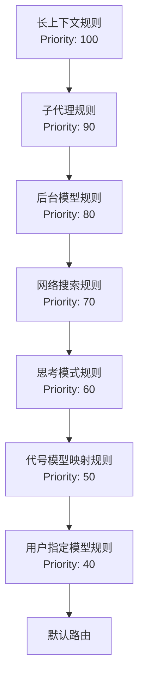

## 规则详细说明

### 1. 长上下文规则 (longContext)
**优先级**: 100 | **类型**: `tokenThreshold`

**逻辑**: 当请求的token数量超过阈值时，使用长上下文专用模型。

```json
{
  "name": "longContext",
  "priority": 100,
  "enabled": true,
  "condition": {
    "type": "tokenThreshold",
    "value": 60000,
    "operator": "gt"
  },
  "action": {
    "route": "sonnet,MiniMax-M2",
    "transformers": []
  }
}
```

**流程图**:
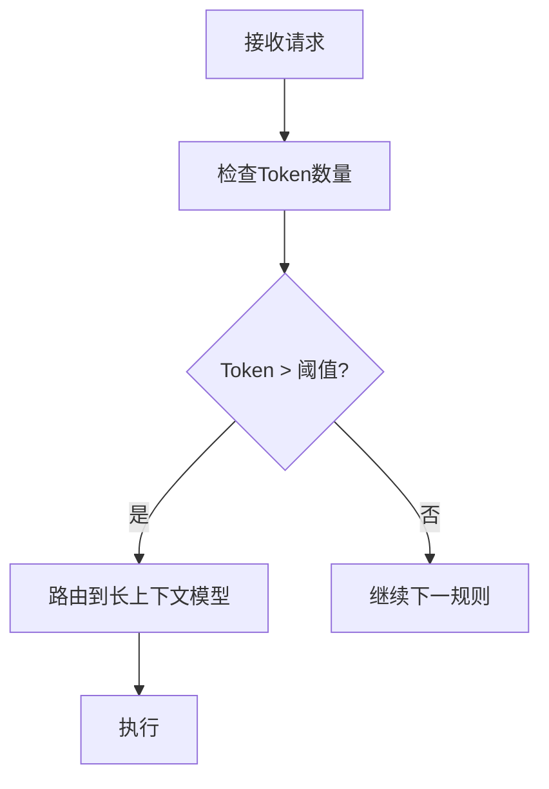

### 2. 子代理规则 (subagent)
**优先级**: 90 | **类型**: `fieldExists` + `contains`

**逻辑**: 检测系统消息中包含子代理模型标记时，从标记中提取模型信息。

```json
{
  "name": "subagent",
  "priority": 90,
  "enabled": true,
  "condition": {
    "type": "fieldExists",
    "field": "system.1.text",
    "operator": "contains",
    "value": "<CCR-SUBAGENT-MODEL>"
  },
  "action": {
    "route": "${subagent}",
    "transformers": []
  }
}
```

**流程图**:
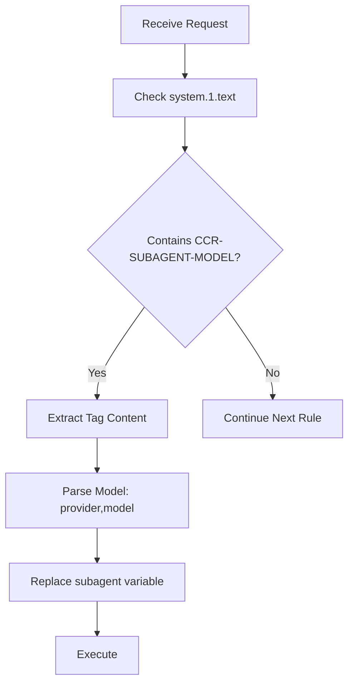

**变量替换机制**:
- 搜索所有system消息的`content`或`text`字段（兼容两种格式）
- 匹配正则: `<CCR-SUBAGENT-MODEL>(.*?)<\/CCR-SUBAGENT-MODEL>`
- 提取的内容格式: `provider,model`

**兼容性说明**:
- 条件检查使用 `system.1.text` 字段路径
- 但实际兼容 `content` 和 `text` 两种字段格式
- 向后兼容老用户的 `text` 字段配置

### 3. 后台模型规则 (background)
**优先级**: 80 | **类型**: `modelContains`

**逻辑**: 当模型名包含"haiku"时，自动路由到轻量级后台模型。

```json
{
  "name": "background",
  "priority": 80,
  "enabled": true,
  "condition": {
    "type": "modelContains",
    "value": "haiku",
    "operator": "contains"
  },
  "action": {
    "route": "haiku,MiniMax-M2",
    "transformers": []
  }
}
```

**流程图**:
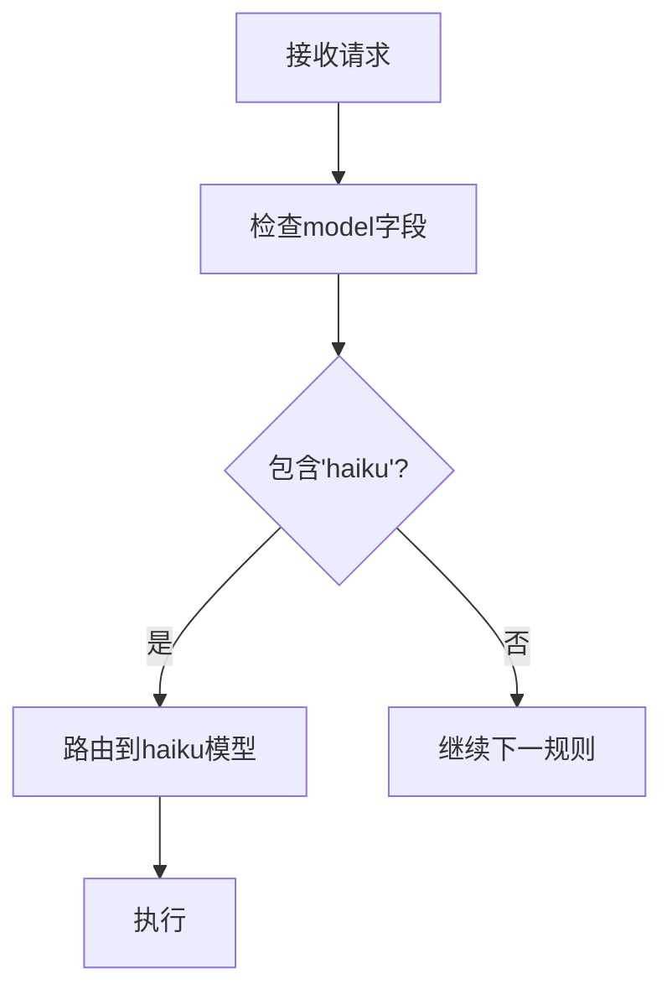

### 4. 网络搜索规则 (webSearch)
**优先级**: 70 | **类型**: `toolExists`

**逻辑**: 检测到web_search工具时，使用特定模型处理网络搜索任务。

```json
{
  "name": "webSearch",
  "priority": 70,
  "enabled": true,
  "condition": {
    "type": "toolExists",
    "value": "web_search",
    "operator": "exists"
  },
  "action": {
    "route": "sonnet,MiniMax-M2",
    "transformers": []
  }
}
```

**流程图**:
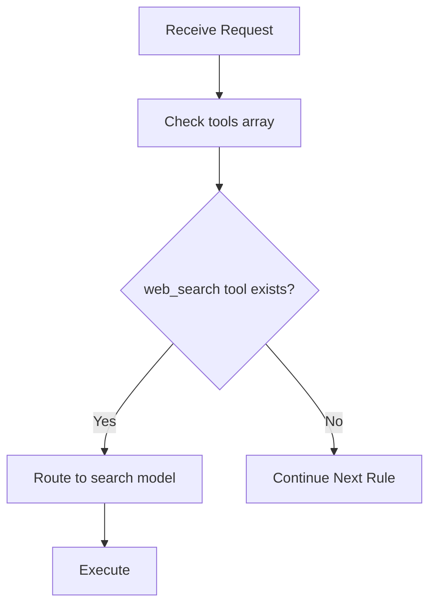

**工具检测逻辑**:
- 检查`tools`数组中每个工具的`type`或`function.name`
- 匹配包含"web_search"的工具

### 5. 思考模式规则 (thinking)
**优先级**: 60 | **类型**: `fieldExists` + `exists`

**逻辑**: 检测请求体中存在thinking参数时，使用专用思考模型。

```json
{
  "name": "thinking",
  "priority": 60,
  "enabled": true,
  "condition": {
    "type": "fieldExists",
    "field": "thinking",
    "operator": "exists"
  },
  "action": {
    "route": "opus,MiniMax-M2",
    "transformers": []
  }
}
```

**流程图**:
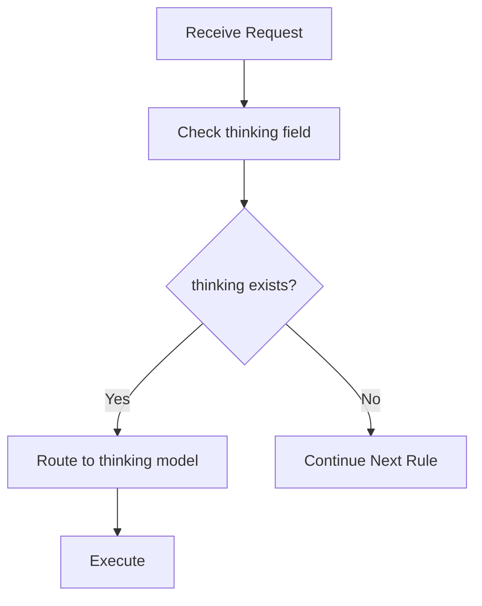

### 6. 代号模型映射规则 (directMapping)
**优先级**: 50 | **类型**: `custom` - `directModelMapping`

**逻辑**: 将provider作为代号名称，直接映射provider绑定的model模型。

```json
{
  "name": "directMapping",
  "priority": 50,
  "enabled": true,
  "condition": {
    "type": "custom",
    "customFunction": "directModelMapping"
  },
  "action": {
    "route": "${mappedModel}",
    "transformers": []
  }
}
```

**自定义函数逻辑**:
```javascript
case "directModelMapping":
  const model = context.req?.body?.model;
  return model !== undefined && !model.includes(",");
```

**流程图**:
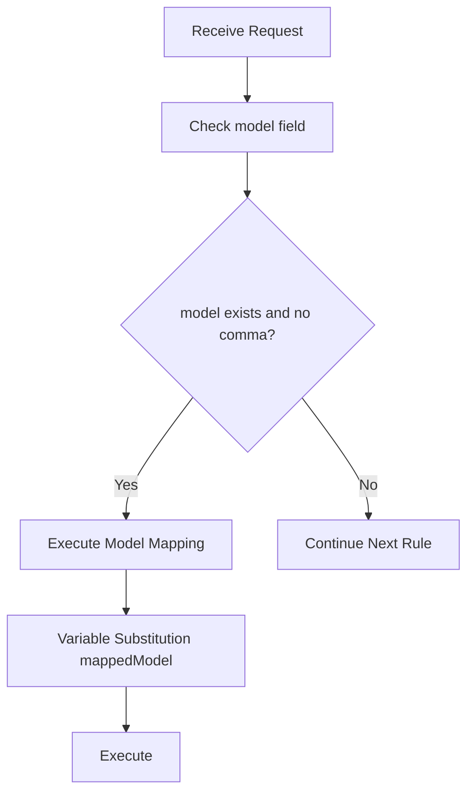

**模型映射算法** (`mapDirectModelToProvider`):
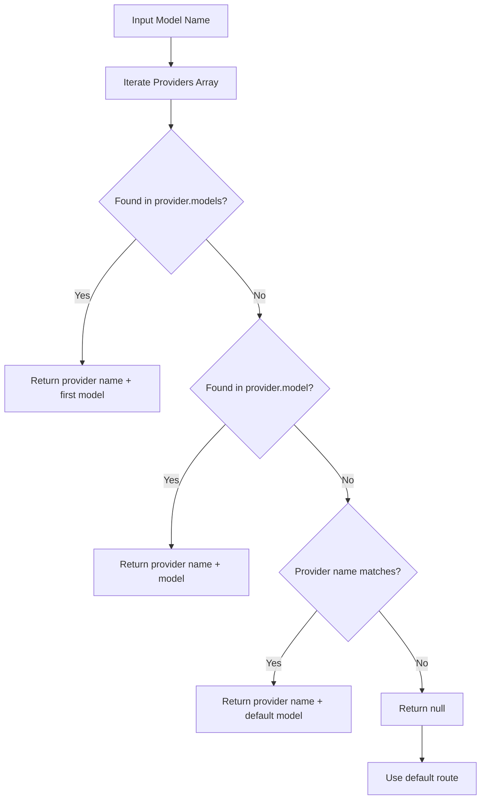

### 7. 用户指定模型规则 (userSpecified)
**优先级**: 40 | **类型**: `custom` - `modelContainsComma`

**逻辑**: 用户直接指定provider,model格式时，原样返回。

```json
{
  "name": "userSpecified",
  "priority": 40,
  "enabled": true,
  "condition": {
    "type": "custom",
    "customFunction": "modelContainsComma"
  },
  "action": {
    "route": "${userModel}",
    "transformers": []
  }
}
```

**自定义函数逻辑**:
```javascript
case "modelContainsComma":
  return context.req?.body?.model?.includes(",") || false;
```

**流程图**:
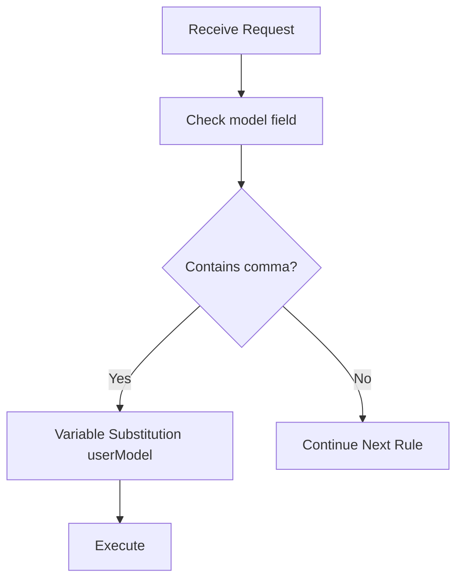

## 变量替换机制

### 支持的变量

| 变量名 | 来源 | 替换逻辑 |
|--------|------|----------|
| `${userModel}` | `req.body.model` | 直接替换为用户指定的模型名 |
| `${subagent}` | system消息中的标记 | 提取`<CCR-SUBAGENT-MODEL>`内容 |
| `${mappedModel}` | Provider配置 | 通过模型映射算法转换 |

### 替换流程

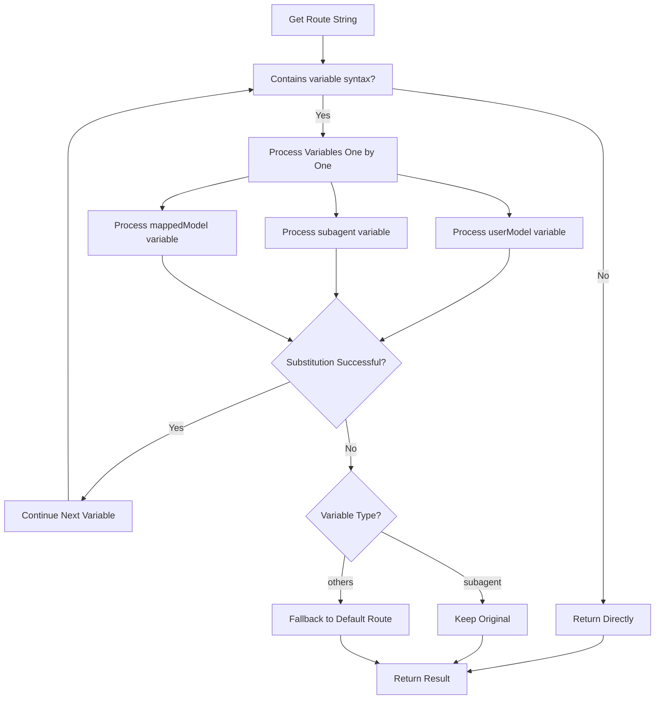

## 条件类型说明

### 1. tokenThreshold
**用途**: 基于token数量进行条件判断

**参数**:
- `value`: 阈值数字
- `operator`: `gt`(大于), `lt`(小于), `eq`(等于)

**示例**:
```json
{
  "type": "tokenThreshold",
  "value": 60000,
  "operator": "gt"
}
```

### 2. modelContains
**用途**: 检查模型名是否包含指定字符串

**参数**:
- `value`: 要检查的字符串
- `operator`: `contains`(包含), `startsWith`(以...开头), `eq`(等于)

**示例**:
```json
{
  "type": "modelContains",
  "value": "haiku",
  "operator": "contains"
}
```

### 3. toolExists
**用途**: 检查请求中是否存在指定工具

**参数**:
- `value`: 工具名称
- `operator`: `exists`(存在)

**示例**:
```json
{
  "type": "toolExists",
  "value": "web_search",
  "operator": "exists"
}
```

### 4. fieldExists
**用途**: 检查请求体中指定字段是否存在或包含内容

**参数**:
- `field`: 字段路径 (支持点号分隔的嵌套路径，如`system.1.text`)
- `operator`: `exists`(存在), `contains`(包含), `eq`(等于)
- `value`: 当operator为`contains`或`eq`时需要提供

**示例**:
```json
{
  "type": "fieldExists",
  "field": "system.1.text",
  "operator": "contains",
  "value": "<CCR-SUBAGENT-MODEL>"
}
```

**特殊兼容逻辑**:
- 当字段路径匹配 `system.X.text` 格式时，自动兼容 `content` 和 `text` 两种字段
- 优先使用 `content` 字段，备选 `text` 字段
- 确保老用户配置无需修改即可正常工作

### 5. custom
**用途**: 使用自定义函数进行条件判断

**参数**:
- `customFunction`: 函数名

**内置函数**:
- `modelContainsComma`: 检查模型名是否包含逗号
- `directModelMapping`: 检查是否为provider代号(不包含逗号)

**示例**:
```json
{
  "type": "custom",
  "customFunction": "directModelMapping"
}
```

### 6. externalFunction
**用途**: 调用外部JavaScript文件中的函数

**参数**:
- `externalFunction.path`: JavaScript文件路径
- `externalFunction.functionName`: 函数名 (可选，默认`evaluate`)

**示例**:
```json
{
  "type": "externalFunction",
  "externalFunction": {
    "path": "./user-check.js",
    "functionName": "checkUserType"
  }
}
```

## 完整请求处理流程

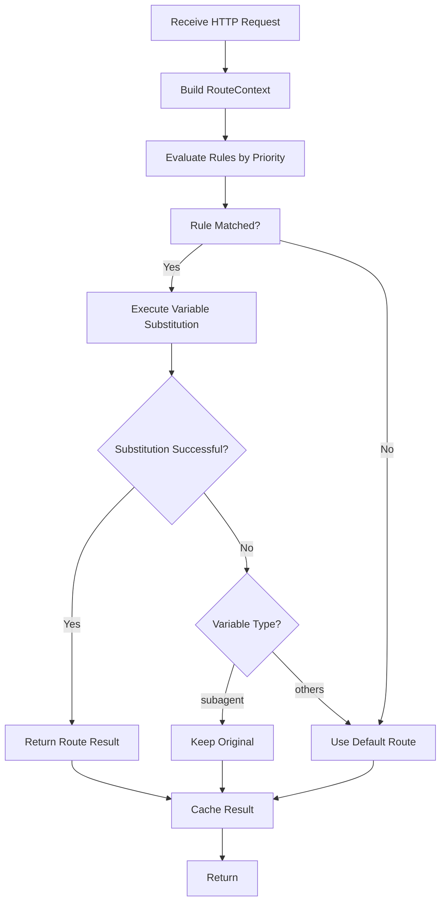

## 关键注意事项

1. **字段路径**: 使用`fieldExists`条件时，字段路径支持嵌套访问，如`system.1.text`访问`request.body.system[1].text`（但自动兼容`content`字段）

2. **系统消息结构**: 子代理标记检查`system.1.text`，但兼容`content`和`text`两种字段格式，假设系统消息数组索引1为子代理配置

3. **代号映射**: `directMapping`规则仅处理简单模型名(不含逗号)，包含逗号的模型名由`userSpecified`规则处理

4. **变量替换失败**:
   - `${subagent}`替换失败时保持原样，允许上游处理
   - 其他变量替换失败时回退到默认路由

5. **优先级冲突**: 高优先级规则匹配后立即执行，不会评估后续规则

6. **缓存机制**: 路由结果默认缓存5分钟，可通过配置调整

## 配置修改指南

### 添加新规则

1. 在`migrateLegacyConfig`函数中添加规则定义
2. 设置正确的优先级 (建议间隔10，便于插入中间优先级规则)
3. 定义条件类型和参数
4. 设置路由目标和变量

### 修改现有规则

1. 确认规则在迁移函数中的位置
2. 修改条件参数或路由目标
3. 更新相关测试用例
4. 验证优先级是否需要调整

### 禁用规则

```json
{
  "name": "规则名",
  "priority": 50,
  "enabled": false,  // 设置为false禁用
  ...
}
```

---

**文档版本**: v2.0.2
**最后更新**: 2025-12-15
**适用范围**: 统一路由引擎 v2.0+
