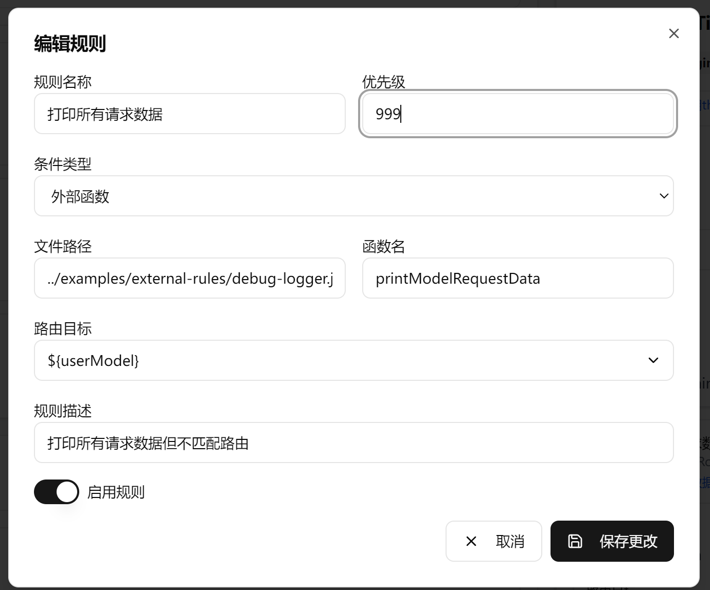

# 🔍 调试日志外部路由脚本使用指南

## 概述

`debug-logger.js` 是一个专门用于打印模型请求数据的外部路由脚本，它具有以下特点：

- ✅ **优先级最高**：可以设置为最高优先级（999），在所有规则之前执行
- ✅ **不拦截路由**：始终返回 `false`，不会影响正常的路由决策
- ✅ **变量式收集**：每种日志类型单独收集，便于选择性输出
- ✅ **文件存储**：自动写入到 `~/.claude-code-router/logs/` 目录
- ✅ **时间戳**：每个日志条目带时间标记，便于追踪
- ✅ **选择性输出**：用户可自由选择要输出的日志类型
- ✅ **增量追加**：日志文件自动按日期命名，内容增量追加
- ✅ **折叠友好**：支持编辑器折叠功能，便于浏览

## 文件结构

```
examples/
├── external-rules/
│   └── debug-logger.js          # 调试日志脚本
├── config-with-debug-logger.json # 使用示例配置
└── README-调试日志脚本.md       # 本文档
```

## 使用方法

### 1. 在配置中添加外部规则

在你的 `config.json` 文件中添加以下规则：

```json
{
  "Router": {
    "rules": [
      {
        "name": "调试日志打印规则",
        "priority": 999,
        "enabled": true,
        "condition": {
          "type": "externalFunction",
          "externalFunction": {
            "path": "../examples/external-rules/debug-logger.js",
            "functionName": "printModelRequestData"
          }
        },
        "action": {
          "route": "sonnet-minimax",
          "description": "打印所有请求数据但不拦截路由"
        }
      }
    ]
  }
}
```


### 2. 启动路由服务

```bash
# 启动路由服务
ccr start

# 或者指定配置文件
ccr start --config ../examples/config-with-debug-logger.json
```

### 3. 选择性输出日志

新版本支持选择性输出特定类型的日志，方便调试特定问题：

#### 3.1 修改输出类型

在脚本中找到 `outputTypes` 数组（大约在第244行），根据需要修改：

```javascript
// 只输出基本信息和消息内容
const outputTypes = ['basic', 'messages'];

// 或者只输出请求头和使用统计
const outputTypes = ['headers', 'usage'];

// 完整的输出类型列表：
// 'basic'     - 基本信息 (Token数量、会话ID等)
// 'headers'   - 请求头信息
// 'messages'  - 消息内容
// 'system'    - 系统消息
// 'tools'     - 可用工具
// 'body'      - 请求体原始数据
// 'usage'     - 使用统计
// 'event'     - 事件信息
```

#### 3.2 查看日志文件

日志会自动写入到 `~/.claude-code-router/logs/` 目录，按日期命名：

```bash
# 查看日志目录
ls -la ~/.claude-code-router/logs/

# 实时查看最新日志
tail -f ~/.claude-code-router/logs/debug-logger-$(date +%Y-%m-%d).log

# 查看今天的日志
cat ~/.claude-code-router/logs/debug-logger-$(date +%Y-%m-%d).log
```

### 4. 查看调试日志

启动服务后，每次有请求时都会在控制台看到详细的调试信息：

```
========================================
🔍 【调试日志】模型请求数据
========================================

📊 【基本信息】
  Token 数量: 1234
  会话ID: session_abc123
  请求ID: req_xyz789

📋 【请求头】
  content-type: application/json
  x-user-id: user123

💬 【消息内容】(共 3 条)

  [消息 1]
    Role: user
    Content: 你好，请帮我写一个Hello World程序...

⚙️ 【系统消息】(共 1 条)

  [系统消息 1]
    Content: 你是一个有用的AI助手...

🔧 【可用工具】(共 2 个)

  [1] web_search
    Description: Search the web for information

  [2] code_execution
    Description: Execute code

📦 【请求体原始数据】
{
  body: {
    model: 'sonnet-minimax',
    messages: '[包含 3 条消息的数组]',
    system: '[包含 1 条系统消息的数组]'
  }
}

========================================
✅ 【调试日志】打印完成 - 路由继续执行
========================================
```

## 日志内容说明

调试日志会打印以下信息：

### 1. 基本信息
- **Token 数量**：当前请求的 token 数量
- **会话ID**：请求的会话标识
- **请求ID**：请求的唯一标识

### 2. 请求头
- 显示 HTTP 请求头信息
- 包含用户标识、认证信息等

### 3. 消息内容
- **Role**：消息发送者（user/assistant/system）
- **Content**：消息内容（自动截断超长内容）
- **Tool Calls**：工具调用信息（如果有）

### 4. 系统消息
- 系统级别的指令和配置
- 包含角色定义、行为规范等

### 5. 可用工具
- 当前会话中可用的工具列表
- 工具名称、描述和参数模式

### 6. 请求体原始数据
- 完整的请求数据结构
- 包含模型、参数等所有请求信息

### 7. 使用统计
- 输入/输出 token 数量
- 估算成本（如果可用）

## 实际应用场景

### 1. 调试路由规则
```bash
# 查看路由决策过程
# 通过日志确认请求是否按照预期路由
```

### 2. 分析请求模式
```bash
# 了解用户的请求习惯
# 分析常用的工具调用
```

### 3. 性能优化
```bash
# 分析 token 使用量
# 识别大请求模式
```

### 4. 问题排查
```bash
# 查看请求是否正确传递
# 验证系统消息和工具配置
```

### 5. 日志文件分析
```bash
# 查看历史日志
cat ~/.claude-code-router/logs/debug-logger-2025-12-17.log

# 搜索特定会话ID
grep "session_abc123" ~/.claude-code-router/logs/debug-logger-*.log

# 分析某一天的日志
grep "2025-12-17" ~/.claude-code-router/logs/debug-logger-*.log
```

### 6. 选择性调试
```javascript
// 当只需要调试 Token 使用情况时
const outputTypes = ['basic', 'usage'];

// 当需要调试请求结构时
const outputTypes = ['headers', 'body'];

// 当需要调试消息内容时
const outputTypes = ['messages', 'system'];
```

## 注意事项

1. **性能影响**：调试日志会增加一定的性能开销，建议在生产环境中禁用
2. **日志量**：大量请求时会产生大量日志，日志文件会按日期自动分割
3. **敏感信息**：日志可能包含敏感数据，注意保护日志文件
4. **优先级设置**：确保调试规则的优先级高于其他规则（使用999或更高）
5. **文件位置**：日志默认存储在 `~/.claude-code-router/logs/` 目录
6. **磁盘空间**：长时间运行会积累日志文件，定期清理不需要的日志
7. **选择性输出**：合理使用选择性输出功能，减少不必要的日志

## ⚠️ 重要修复记录

### v2.0 - 全新重构版本

**新特性**：
- ✅ 变量式日志收集：每种日志类型单独存储，便于选择性输出
- ✅ 文件存储：自动写入到 `~/.claude-code-router/logs/` 目录
- ✅ 时间戳：每个日志条目带 ISO 8601 时间标记
- ✅ 增量追加：日志文件按日期命名，内容自动追加
- ✅ 选择性输出：用户可自由组合要输出的日志类型
- ✅ 折叠友好：支持编辑器折叠功能，便于浏览长日志

**使用方法**：
```javascript
// 修改 outputTypes 数组来选择日志类型
const outputTypes = ['basic', 'messages'];  // 只输出基本信息和消息
```

**影响**：提供更灵活、更实用的调试日志功能，同时保持零性能影响原始请求。

---

### v1.1 - 修复请求体数据被意外修改的问题

**问题描述**：调试日志脚本在打印请求体数据时，意外修改了原始的 `context.req.body` 对象，导致发送到 API 的请求缺少必要的消息数据，引发 "invalid params" 错误。

**根本原因**：虽然创建了 `safeReq` 对象来避免循环引用，但 `safeReq.body` 实际上是对原始 `context.req.body` 的引用。当执行以下操作时：
```javascript
safeReq.body.messages = `[包含 ${safeReq.body.messages.length} 条消息的数组]`;
```
实际上是在修改原始的 `context.req.body.messages`！

**解决方案**：在修改 `safeReq.body` 之前，先创建它的深拷贝：
```javascript
// 创建 body 的深拷贝，避免修改原始数据
if (safeReq.body) {
  safeReq.body = { ...safeReq.body };  // 关键修复：创建副本
  // 现在可以安全地修改副本，不会影响原始数据
  if (safeReq.body.messages) {
    safeReq.body.messages = `[包含 ${safeReq.body.messages.length} 条消息的数组]`;
  }
  // ...
}
```

**影响**：此修复确保调试日志功能不会影响正常的 API 请求，同时保持完整的调试信息输出。

**升级说明**：如果您之前遇到了 "invalid params" 错误，请更新到修复版本并重新测试。

---

## 故障排查

### 错误：外部函数不是一个有效的函数

如果遇到以下错误：
```
❌ [ERROR] 外部函数 ../examples/external-rules/debug-logger.js 不是一个有效的函数
```

**解决方案：**

1. **检查路径是否正确**
   ```bash
   # 如果命令行在 dist 目录下运行，需要使用上级路径
   "path": "../examples/external-rules/debug-logger.js"

   # 或者使用绝对路径
   # 在配置文件中使用绝对路径：
   "path": "/path/to/your/project/examples/external-rules/debug-logger.js"
   ```

2. **确认函数导出方式**
   ```javascript
   // 使用 module.exports 导出，统一方案
   module.exports = printModelRequestData;
   ```

3. **验证文件是否存在**
   ```bash
   ls examples/external-rules/debug-logger.js
   ```

4. **检查Node.js语法**
   ```bash
   node -c examples/external-rules/debug-logger.js
   ```

5. **查看详细错误日志**
   ```bash
   # 启动时查看详细错误
   ccr start --log-level debug
   ```

## 示例配置

完整的示例配置请参考：`examples/config-with-debug-logger.json`

该配置包含了：
- 调试日志规则（优先级999）
- 用户指定规则（优先级200）
- 代号映射规则（优先级190）
- 长上下文规则（优先级100）

## 禁用调试日志

只需要将调试规则设置为 `enabled: false` 即可：

```json
{
  "name": "调试日志打印规则",
  "enabled": false,
  ...
}
```

## 总结

调试日志脚本是一个强大的工具，可以帮助你：
- 📊 深入了解请求结构
- 🔍 调试路由规则
- 📈 分析使用模式
- 🐛 排查问题
- 📁 持久化日志记录
- ⚙️ 选择性调试

**v2.0 版本亮点**：
- 🎯 **灵活选择**：通过 `outputTypes` 数组自由选择日志类型
- 💾 **持久存储**：自动写入日志文件，支持历史分析
- ⏰ **时间追踪**：每个日志条目带时间戳，便于问题定位
- 📂 **自动管理**：按日期自动分割，避免单个文件过大

只需要一个简单的配置修改，就能获得详细的请求洞察！
